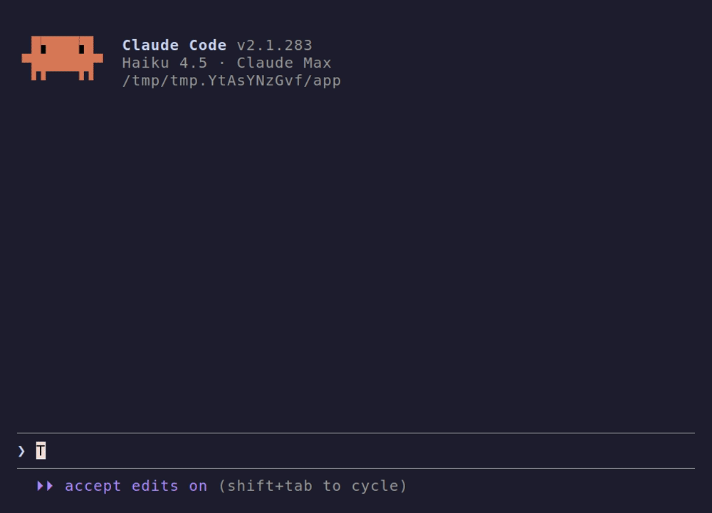

# typeslop

A senior engineer knows slop before reading it: the `retries=3` nobody asked for, the
comment that repeats the next line, the `try` that swallows every error. Coding agents
don't have that glance. Their code passes the tests and still looks wrong.

typeslop gives Claude Code the glance. After each edit, [Jev](https://docs.typesafe.ai), a
small judge model, reads the diff. If it smells, the agent goes back once to simplify it or
say why it should stay. If it's clean, typeslop stays silent.



In its first week on my machines it sent back one turn in ten, and the agent changed the
code two times out of three.

## Install

You need Python 3.12+, `git` and a Jev key from
[console.typesafe.ai/keys](https://console.typesafe.ai/keys):

```
export TYPESAFE_API_KEY=…   # or OPENROUTER_API_KEY, or AI_GATEWAY_API_KEY for Vercel
```

Then in Claude Code:

```
/plugin marketplace add hanneslipusch/typeslop
/plugin install typeslop@typeslop
```

To judge your current branch, ask Claude to run `typeslop check`.

## How it works

- After an edit, the agent gets a note if the file smells. You see the same note.
- When the agent or a subagent finishes, typeslop blocks it once if a file still smells.
- A missing key or API error is reported once and never blocks.

[`rubric.json`](rubric.json) lists every smell. The thresholds are at the top of
[`bin/typeslop`](bin/typeslop), and [`eval/`](eval/README.md) measures a change before you
ship it.

## Privacy and cost

typeslop sends each edited file's diff to Jev, and a diff can contain secrets. A judgment
costs about $0.0002.

## License

MIT
